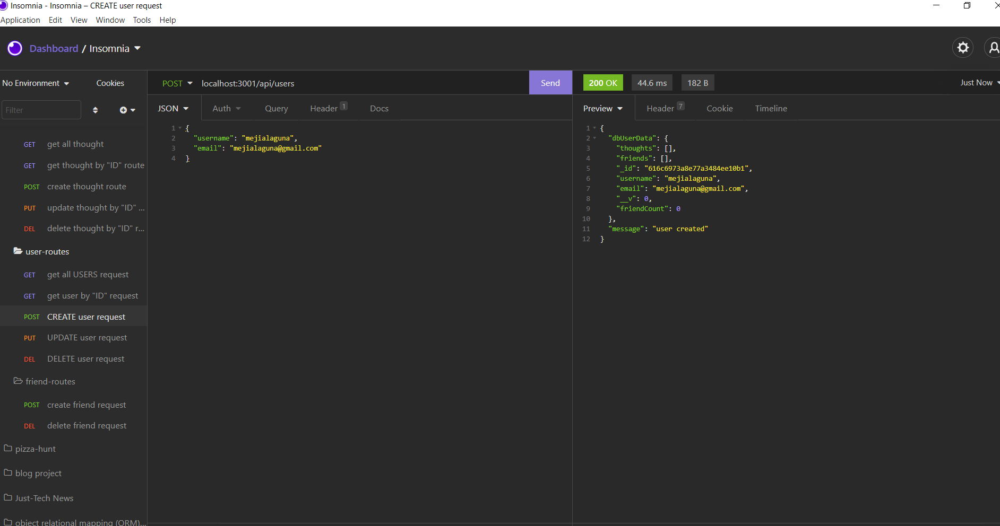
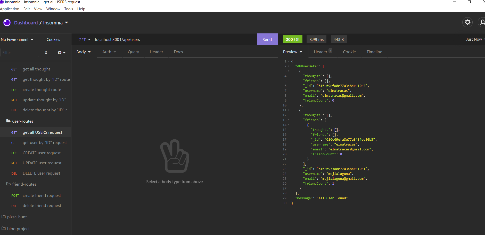
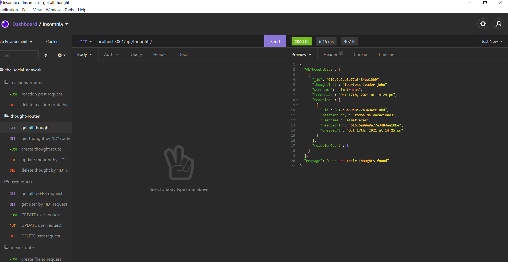

  
   
  
  

  
  
  <h1> the_social_network   
   
</h1>

    
    
    
    
    
    

   
   
   
  
  <a href="#about"><strong>Explore the screenshots »</strong></a>
   
   
  
  

  
  
  
  

   
  
  
  
    
  

  
   
  
  

  
Table of Contents

  
  - [About](#about)
  - [Built With](#built-with)
  - [Installation](#installation)
  - [Authors & contributors](#authors--contributors)
  - [Acknowledgements](#Acknowledgements)
  - [License](#License) 
  
  
  
  
   
  
  ## About
  ---

   

 
 My social network end point that uses a NoSQL database
 SO THAT my website can handle large amounts of unstructured data using post , get , put and delete request.
  

   
   

  

  
Usage Screenshots and Demo

    
  
   
   
   
  
   
   
  
    
   

   
   

please to watch the A walkthrough video demonstrating the functionality of the application. <a href= "https://www.awesomescreenshot.com/video/5658654?key=d2e0f9782e467d4e2035f33e48a1674c">click here </a>

  

  
   
   
  
  
  ## Built With
  ---

   

> - 
> - 
> - 
> - 
> - 
> - 
> - 
> - 

   
   
  
  ##  Installation
  ---

   
  
   1. Clone this https://github.com/mejialaguna/the_social_network.git .
   2. Install node js <a href="https://nodejs.org/en/"> [ HERE ]</a>. 
   3. inside your terminal.   
   4. Install all Dependency using ----> npm i.  
   5. Start your server using nodemon server or npm start inside your terminal.   
   6. or click on this <a href="https://www.awesomescreenshot.com/video/5658654?key=d2e0f9782e467d4e2035f33e48a1674c"> link</a> and fallow along.
   6. Enjoy

   
   
  
  
  ##  Authors & contributors
  ---

   
   
  Jose Luis Mejia Laguna.
  
   
   
  
  ## Acknowledgements
  ---

   

First off , thanks for taking the time to check out my app! , contribution are what make this open-source community such an amazing place to learn , inspire and create. Any contribution you make will benefit everyone interested in using the app and are very appriciated.

---

   
   
  
  ## License
  ---
   

  
  
  
  

# Acceptance Criteria
GIVEN a social network API
WHEN I enter the command to invoke the application,
THEN my server is started and the Mongoose models are synced to the MongoDB database, 
WHEN I open API GET routes in Insomnia Core for users and thoughts
THEN the data for each of these routes is displayed in a formatted JSON,  
WHEN I test API POST, PUT, and DELETE routes in Insomnia Core
THEN I am able to successfully create, update, and delete users and thoughts in my database,
 
WHEN I test API POST and DELETE routes in Insomnia Core
THEN I am able to successfully create and delete reactions to thoughts and add and r